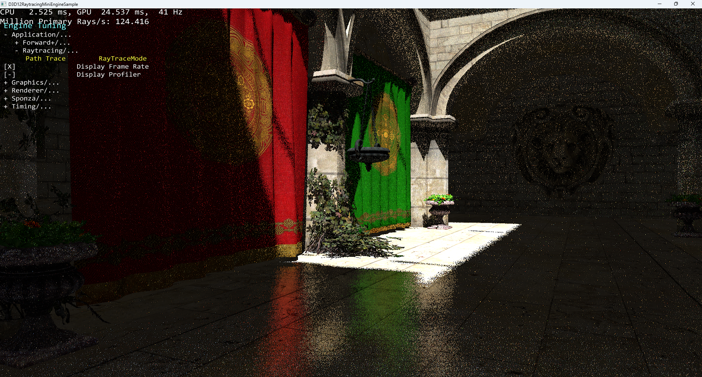

# DXRPathTracer

A simple path tracer using the MiniEngine from DirectX-Graphics-Samples

## Getting started
* Open DXRPathTracer/Samples/Desktop/D3D12Raytracing/src/D3D12Raytracing.sln
* Select configuration: Debug (full validation), Profile (instrumented), Release
* Select platform
* Build and run

## Raytracing Modifications

This is a modified version of MiniEngine that uses the DirectX Raytracing for a series of effects.

The keys '1'...'7' can also be used to cycle through different modes (or using Backspace to open up the MiniEngine and going to Application/Raytracing/RaytraceMode): 
* *Off* - [1] Full rasterization.
* *Bary Rays* - [2] Primary rays that return the barycentric of the intersected triangle.
* (Broken) *Refl Bary* - [3] Secondary reflection rays that return the barycentric of the intersected triangle.
* *Shadow Rays* - [4] Secondary shadow rays are fired and return black/white depending on if a hit is found.
* *Diffuse&ShadowMaps* - [5] Primary rays are fired that calculate diffuse lighting and use a rasterized shadow map.
* *Diffuse&ShadowRays* - [6] Fully-raytraced pass that shoots primary rays for diffuse lights and recursively fires shadow rays.
* *Reflection Rays* - [7] Hybrid pass that renders primary diffuse with rasterization and if the ground plane is detected, fires of reflections rays.
* (New) "Path Tracing" - [8] Fully-pathtraced pass that recursively shoots primary rays for diffuse lights
* (New) "Denoised Path Tracing" - [9] Simple 3x3 box blur denoised path tracing

## Controls:
* forward/backward/strafe: left thumbstick or WASD (FPS controls)
* up/down: triggers or E/Q
* yaw/pitch: right thumbstick or mouse
* toggle slow movement: click left thumbstick or lshift
* open debug menu: back button or backspace
* navigate debug menu: dpad or arrow keys
* toggle debug menu item: A button or return
* adjust debug menu value: dpad left/right or left/right arrow keys

## Requirements
Same as [DirectX-Graphics-Samples (main branch)](https://github.com/microsoft/DirectX-Graphics-Samples)
and [D3D12Raytracing](https://github.com/microsoft/DirectX-Graphics-Samples/tree/master/Samples/Desktop/D3D12Raytracing)
